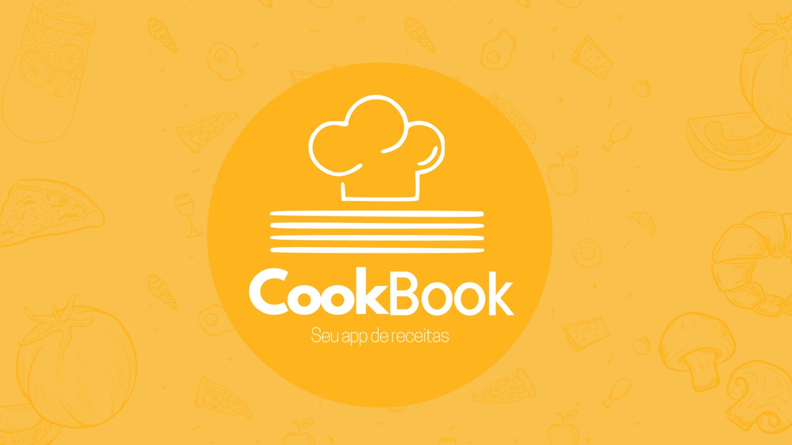

# App de Receitas 🍔🍹

## Descrição

Bem-vindo ao App de Receitas Cookbook, um projeto incrível que permite aos usuários encontrar, explorar e salvar suas receitas favoritas de comidas e bebidas. Este aplicativo é desenvolvido com as mais modernas tecnologias do ecossistema React, incluindo Hooks e Context API.

## App Online aqui: (https://app-de-receitas-rosy.vercel.app/meals)

## Funcionalidades

- Pesquisa e filtragem de receitas.
- Favoritar receitas.
- Acompanhamento do progresso de preparação.
- Diversas categorias para explorar.

## Video do app click para baixar

## Como Usar

1. Clone o repositório.
2. Instale as dependências com `npm install`.
3. Inicie o aplicativo com `npm start`.

## Tecnologias Utilizadas

- React
- Redux
- Context API
- Cypress (para testes)
- E muitas outras...

## Contribuição

Contribuições são bem-vindas! Se você deseja melhorar este projeto de alguma forma, fique à vontade para abrir uma issue ou um pull request.

## Licença

Este projeto está sob a Licença MIT. Consulte o arquivo [LICENSE](link-para-licenca) para obter mais informações.

## Contato

Se tiver alguma dúvida ou precisar de suporte, sinta-se à vontade para nos contatar pelo email [juniorpastorini_@hotmail.com](mailto:juniorpastorini_@hotmail.com).

Divirta-se explorando e preparando deliciosas receitas com o App de Receitas! 😋👩‍🍳👨‍🍳
